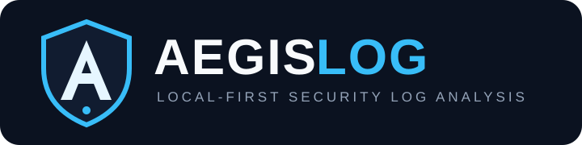

<div align="center">



<br/>

**Terminal-first defensive log investigation for analysts who want evidence, not noise.**

[](https://github.com/HR-Presents/AegisLog-AI/actions/workflows/ci.yml)
[](https://github.com/HR-Presents/AegisLog-AI/actions/workflows/security.yml)
[](https://github.com/HR-Presents/AegisLog-AI/releases/latest)
[](LICENSE)

[**Download**](https://github.com/HR-Presents/AegisLog-AI/releases/latest) · [User Guide](docs/USER_GUIDE.md) · [Commands](docs/COMMANDS.md) · [Security](SECURITY.md) · [Contributing](CONTRIBUTING.md)

`LOCAL-FIRST` &nbsp; `READ-ONLY` &nbsp; `DETERMINISTIC` &nbsp; `DEFENSIVE`

</div>

---

## A security investigation console, not another noisy scanner

AegisLog turns raw logs into structured investigation context while keeping analysis local and retained evidence visible. Its core detection and correlation pipeline is deterministic: findings are signals for analyst review, never automatic claims of compromise or attribution.

### Core capabilities

| | Capability | What it gives the analyst |
|---|---|---|
| **01** | **ANALYZE** | Parse a log, surface findings, correlate incidents, and generate a self-contained report. |
| **02** | **LIVE MONITOR** | Watch a log source continuously with read-only detection. |
| **03** | **MULTI-SOURCE** | Correlate activity across multiple live telemetry sources. |
| **04** | **NATIVE TELEMETRY** | Inspect supported Windows, Linux, and Docker sources. |
| **05** | **INCIDENTS** | Review evidence chains, severity, confidence, and investigation context. |
| **06** | **REPORTING** | Produce analyst-oriented HTML evidence reports that stay local. |

No AI Analyst, remote model workflow, auto-remediation, exploitation, persistence, credential theft, or silent host modification is part of the supported product surface.

---

## Terminal experience

AegisLog v2.0 uses one visual hierarchy throughout Mission Control: **brand → workspace → priority information → action → metadata**. Blue identifies the product and navigation; green, amber, and red are reserved for real system/security state.

```text
   /\      A E G I S L O G
  /  \     DEFENSIVE LOG INVESTIGATION
  \/\/     LOCAL-FIRST / READ-ONLY / DETERMINISTIC

--------------------------------------------------------------------------------
MISSION CONTROL                                                     v2.1.0
                                                            + SYSTEM READY

INVESTIGATION                              MONITORING
01  ANALYZE                                02  LIVE MONITOR
    Investigate a log and generate             Watch one log source
    an evidence report                         continuously

06  INCIDENTS                              03  MULTI-SOURCE
    Review correlated evidence chains          Correlate live sources

04  NATIVE LOGS                            05  NATIVE MONITOR
    Inspect OS/container telemetry              Watch native telemetry

SYSTEM
07  DEMO        Run the built-in investigation dataset
08  HEALTH      Check engine and collector readiness
09  HELP        Open the command reference
--------------------------------------------------------------------------------
01-09 select    Q EXIT    C command mode    CTRL+C STOPS LIVE VIEWS
```

The rendered layout adapts to terminal width: wide terminals use balanced Investigation and Monitoring areas, while medium and narrow terminals collapse without horizontal overflow. The real `aegis@console >` shell prompt is the only authoritative input prompt.

---

## Quick start

### Windows standalone

1. Open the [latest release](https://github.com/HR-Presents/AegisLog-AI/releases/latest).
2. Download `AegisLog.exe` and, optionally, `AegisLog.exe.sha256`.
3. Verify the checksum if required.
4. Start the console:

```powershell
.\AegisLog.exe start
```

The Windows executable is currently unsigned, so SmartScreen or endpoint-security reputation warnings may appear even when the published checksum matches.

### Python 3.10+

```bash
git clone https://github.com/HR-Presents/AegisLog-AI.git
cd AegisLog-AI
python -m venv .venv
source .venv/bin/activate   # Windows: .venv\Scripts\activate
pip install -e .
aegislog doctor
aegislog start
```

---

## Investigation workflow

```text
TELEMETRY
   │
   ▼
PARSE + NORMALIZE
   │
   ▼
DETERMINISTIC DETECTIONS
   │
   ▼
CORRELATION + ANOMALY CONTEXT
   │
   ▼
INCIDENT QUEUE
   │
   ▼
EVIDENCE-LED REVIEW
   │
   ▼
LOCAL HTML REPORT
```

A high-severity finding or confidence score means **review this evidence carefully**. It does not mean the system is definitely compromised.

---

## Common commands

```text
AegisLog.exe dashboard C:\path\to\auth.log
AegisLog.exe incidents C:\path\to\auth.log
AegisLog.exe explain C:\path\to\auth.log <incident-id>
AegisLog.exe mitre C:\path\to\auth.log

AegisLog.exe live C:\logs\auth.log --profile security
AegisLog.exe live-multi C:\logs\auth.log C:\logs\web.log --profile authentication

AegisLog.exe native-sources
AegisLog.exe native-analyze windows --channel Security
AegisLog.exe native-live journald --profile operations

AegisLog.exe doctor
AegisLog.exe --help
```

See the complete [Command Reference](docs/COMMANDS.md).

---

## Reports

Static investigations can produce a self-contained HTML report with executive assessment, case metadata, severity distribution, incident queue, retained evidence, recommendations, anomaly context, telemetry distribution, and processing limitations. Reports remain local and read-only and can be printed or saved as PDF from the browser.

---

## Security model

AegisLog treats log-derived content as untrusted input and keeps the analyst in control.

- **Read-only host interaction** — investigation does not become remediation.
- **Deterministic local analysis** — detection behavior remains inspectable and testable.
- **Evidence before verdicts** — uncertainty and retained evidence remain visible.
- **No installation telemetry** — the project does not add tracking simply to count users.
- **Safe public collaboration** — issues and reviews should use sanitized or synthetic data.

Read [Security](SECURITY.md), [Threat Model](docs/THREAT_MODEL.md), [Privacy](docs/PRIVACY.md), and [No Auto-Remediation](docs/NO_AUTOREMEDIATION.md).

---

## Documentation

| Start here | Engineering / reference |
|---|---|
| [Installation](docs/INSTALL.md) | [Architecture](docs/ARCHITECTURE.md) |
| [Quick Start](docs/QUICKSTART.md) | [Detection Pipeline](docs/DETECTION_PIPELINE.md) |
| [User Guide](docs/USER_GUIDE.md) | [Parsers](docs/PARSERS.md) |
| [Commands](docs/COMMANDS.md) | [Rules](docs/RULES.md) |
| [Demo](docs/DEMO.md) | [Collectors](docs/COLLECTORS.md) |
| [Troubleshooting](docs/TROUBLESHOOTING.md) | [Testing](docs/TESTING.md) |
| [FAQ](docs/FAQ.md) | [Performance](docs/PERFORMANCE.md) |
| [Documentation Index](docs/README.md) | [Limitations](docs/LIMITATIONS.md) |

---

## Contributing

```bash
python -m venv .venv
source .venv/bin/activate
pip install -e '.[dev]'
pytest
ruff check .
bandit -q -r src
```

Keep pull requests focused, add tests for behavioral changes, and never commit credentials, customer information, or sensitive production logs.

---

## License

AegisLog is released under the [MIT License](LICENSE).

<div align="center">

**AEGISLOG**  ·  Investigate locally. Preserve evidence. Keep the analyst in control.

</div>
